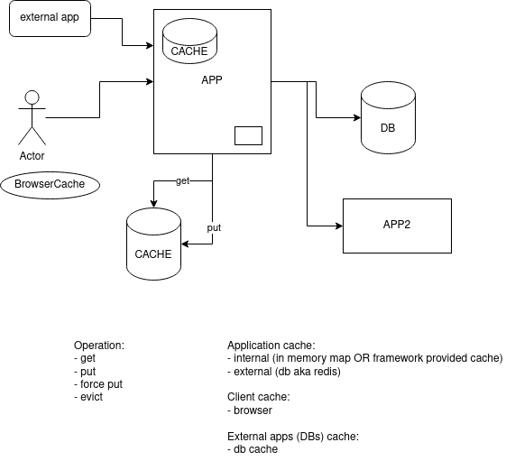

# Demo Project for Online Stream #15 - Cache

Demo project for online stream #15 about caching in general and using it in Spring Boot application.

## Access to Online Stream on YouTube

To get a link to online stream on YouTube please do the following:

- :moneybag: Make any donation to support my volunteering initiative to help Ukrainian Armed Forces by means described on [my website](https://www.yuriytkach.com/volunteer)
- :email: Write me an [email](mailto:me@yuriytkach.com) indicating donation amount and time
- :tv: I will reply with the link to the stream on YouTube.

Thank you in advance for your support! Слава Україні! :ukraine:

## Usage

To start up Redis please use the provided `docker-compose` file:
```shell
docker-compose run .
```

Start application and send requests to:
- http://localhost:8080/op/{name} - first execution runs for 3 sec, next runs faster as data is taken from cache
- http://localhost:8080/up/{name} - force set value under `name`
- http://localhost:8080/clean/{name} - clean cache value for `name`

## Some drawings from Youtube stream


## Useful links:

### Reference Documentation
For further reference, please consider the following sections:

* [Official Gradle documentation](https://docs.gradle.org)
* [Spring Boot Gradle Plugin Reference Guide](https://docs.spring.io/spring-boot/docs/2.7.3/gradle-plugin/reference/html/)
* [Create an OCI image](https://docs.spring.io/spring-boot/docs/2.7.3/gradle-plugin/reference/html/#build-image)
* [Spring Web](https://docs.spring.io/spring-boot/docs/2.7.3/reference/htmlsingle/#web)
* [Spring cache abstraction](https://docs.spring.io/spring-boot/docs/2.7.3/reference/htmlsingle/#io.caching)
* [Spring Data Redis (Access+Driver)](https://docs.spring.io/spring-boot/docs/2.7.3/reference/htmlsingle/#data.nosql.redis)

### Guides
The following guides illustrate how to use some features concretely:

* [Building a RESTful Web Service](https://spring.io/guides/gs/rest-service/)
* [Serving Web Content with Spring MVC](https://spring.io/guides/gs/serving-web-content/)
* [Building REST services with Spring](https://spring.io/guides/tutorials/rest/)
* [Caching Data with Spring](https://spring.io/guides/gs/caching/)
* [Messaging with Redis](https://spring.io/guides/gs/messaging-redis/)

### Additional Links
These additional references should also help you:

* [Gradle Build Scans – insights for your project's build](https://scans.gradle.com#gradle)
